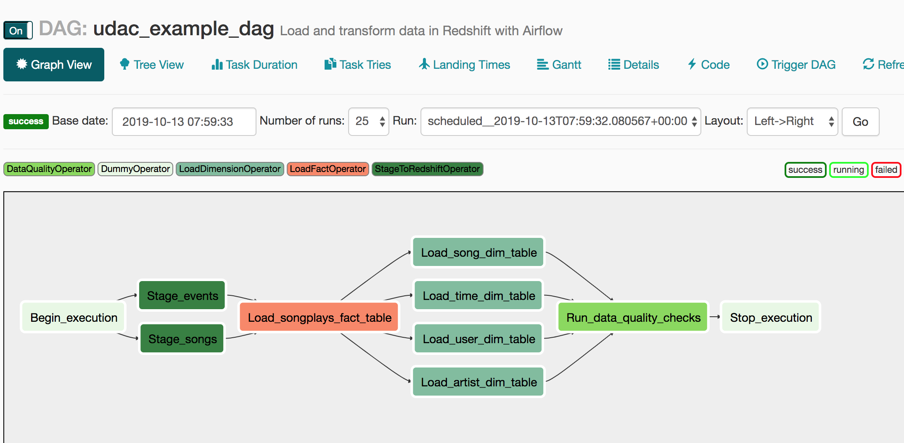
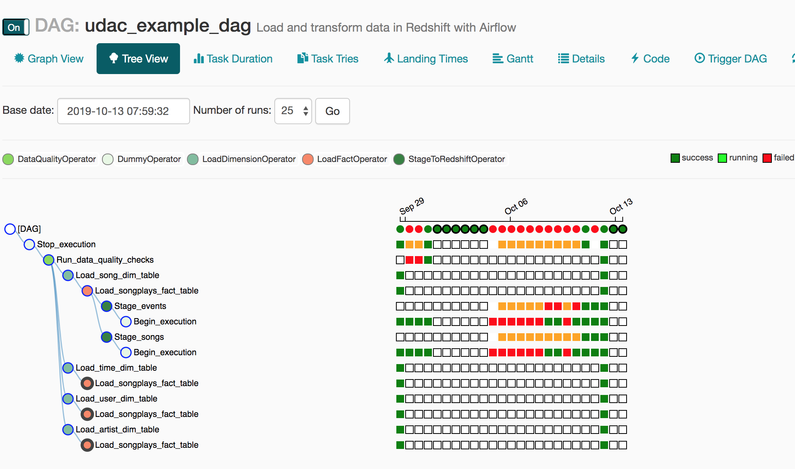

# S3-to-Redshift-ETL-with-Airflow
Automated S3 to Redshift ETL using Airflow DAGs. Data Engineering Nanodegree (2019).

## Data Warehouse Project
## Redshift ETL with Airflow

This project is the implementation in Airflow of a data pipeline workflow (Airflow DAG) that will automate the ETL of loading JSON files from S3 into a Redshift cluster.

The DAG is implemented to load data from S3 into staging tables in Redshift, then dimensional tables and a fact tables are created in Redshift out of the staging tables:

The data resides in S3 objects as JSON files, and so the SQL scripts use the COPY command in Redshift to import all data. 

The below illustrates runs of this DAG (although during development):

